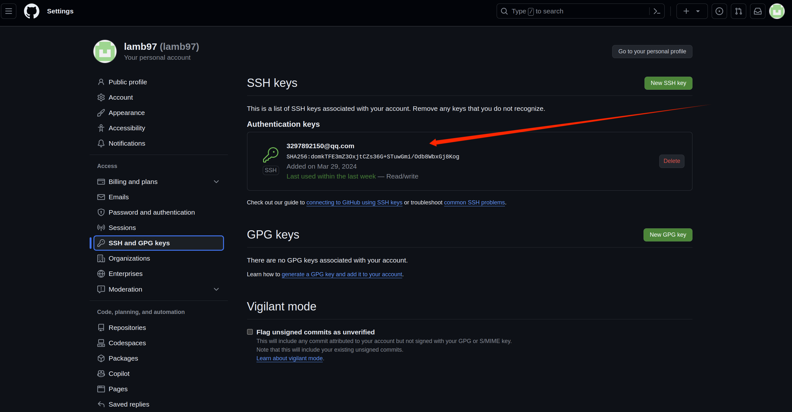
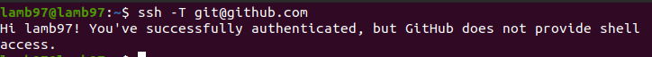
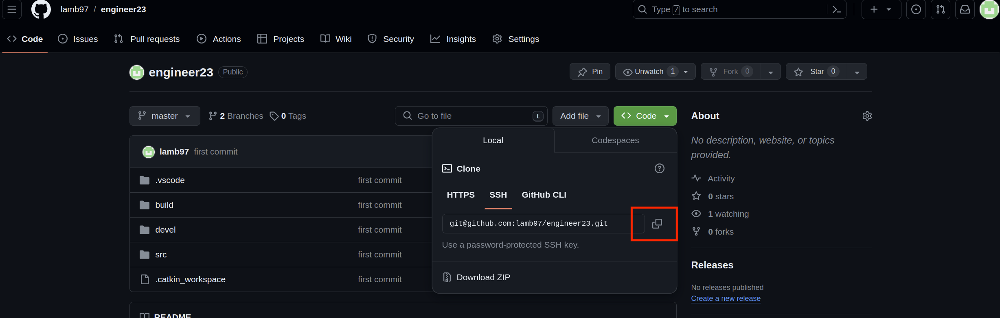
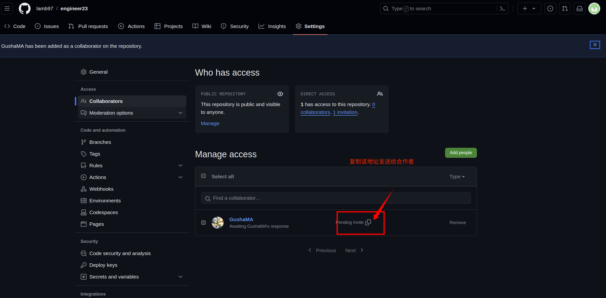
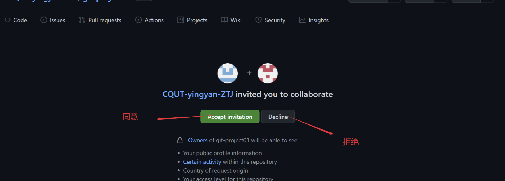
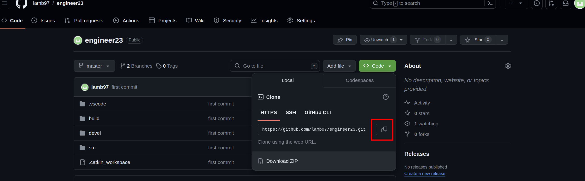

# Github代码管理
## 1.安装Git
```
(1)sudo apt-get install git
(2)git config --global user.name "Your name"
(3)git config --global user.email "email@example.com"
```
## 2.在github上配置SSH—Key
#### 创建SSH-Key，一路按回车
```
$ ssh-keygen -tsra -C "email@example.com"
```
#### 将在 “Home/host(主机名)/” 路径下生成 “.ssh” 文件夹(隐藏文件夹，按ctrl + h显示)，将 “id_rsa.pub” 用gedit打开(或其他可查看文本的软件)，将全部内容复制到github个人主页 github->setting->"SSH and GPG keys->New SSH Key"



## 3.创建自己仓库（可选）
#### github->Your repositories->New
### 3.1 验证是否成功连接github
```
$ ssh -T git@github.com
```

### 3.2 获取远程SSH-Key

()

### 3.2 上传项目文件夹
```
// 1.在本地库添加README文件
$ git add README.md
// 2.初始化
$ git init
// 3.将该文件夹下所有文件上传
$ git add ./
// 4.查看连接状态
$ git status
// 5.将缓存区的修改提交到本地仓库
$ git commit -m "first commit"
// 6.移除已有的地址
$ git remote rm origin
// 7.添加远程地址
$ git remote add origin "copy SSH-Key"
// 8.上传
$ git push -u origin +master

```

## 4.共同管理代码
#### 代码仓库作者(GushaMA(亲爱的马哥))回到github页面，点击settings->Collaborators->add prople,写下你要邀请的合作者的github账号进行邀请：


#### 接下来你把邀请地址粘贴到地址栏：
#### 之后你可以看到如下页面，点击 接受邀请即可：



#### 接下来你可以推送代码了
#### 克隆远端数据仓库到本地：git clone 仓库地址

#### 接下来你可以在对应的文件夹下随意修改代码，修改后进入到文件夹打开终端提交到远程仓库：
```
$ git status
$ git add ./
$ git commit -m "You first commit"
$ git remote rm origin
$ git remote add origin "仓库作者的SSH-Key"
$ git push -u origin +master
```
#### 仓库作者拉取远程仓库中最新的版本
```
$ git pull origin master
```
